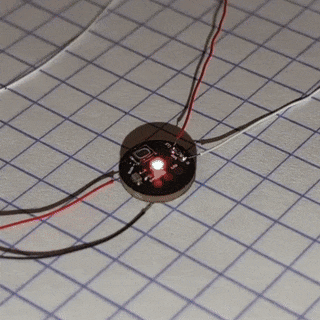
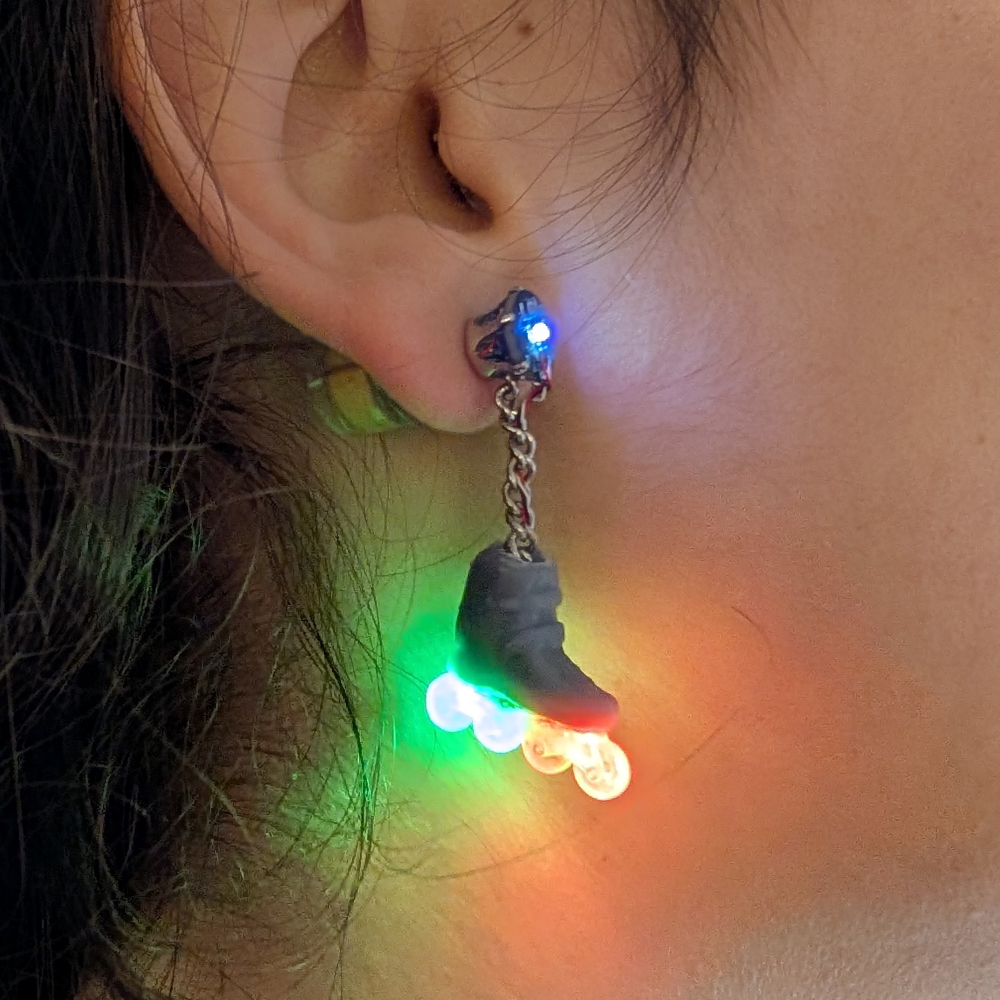

# PicoLed earrings software

  
  

## Hardware target
The only target supported by this software is the PicoLED board hosted in this repo:  
https://gitlab.com/Nathan_G/picoled

## Project structure
- `Core/Src/main.c`: hold all the high-level logic and LED mode transitions of the application.
- `Drivers/`: STM32 HAL and ARM CMSIS
- `picoconf/`: Small lib for handling persistent mode selection by storing data in the embedded flash.
- `picodsp/`: Utility lib with convenient DSP stuff.
- `picoled/`: Small lib to control WS1278 RGB LEDs with Timer and DMA.

## How to import and flash from CubeIDE
1. Clone the repo
2. Import the project
    1. `File > Open Projects from File System...`
    2. Click on `Directory...` and select the repo folder
    3. Click on `Finish`
3. Click `Run` icon, and select `Debug` or `Release` config